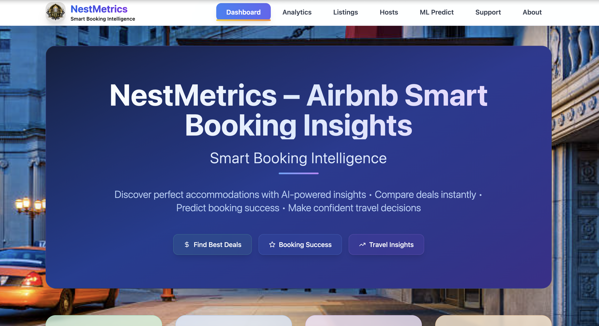
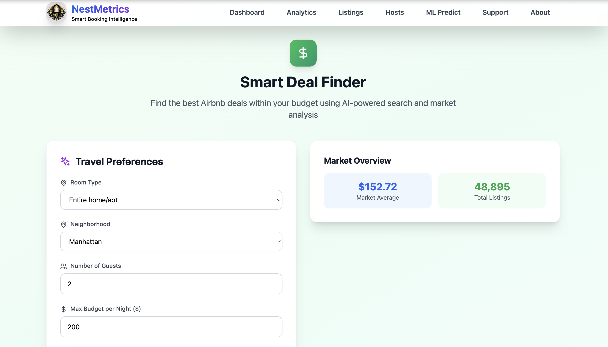
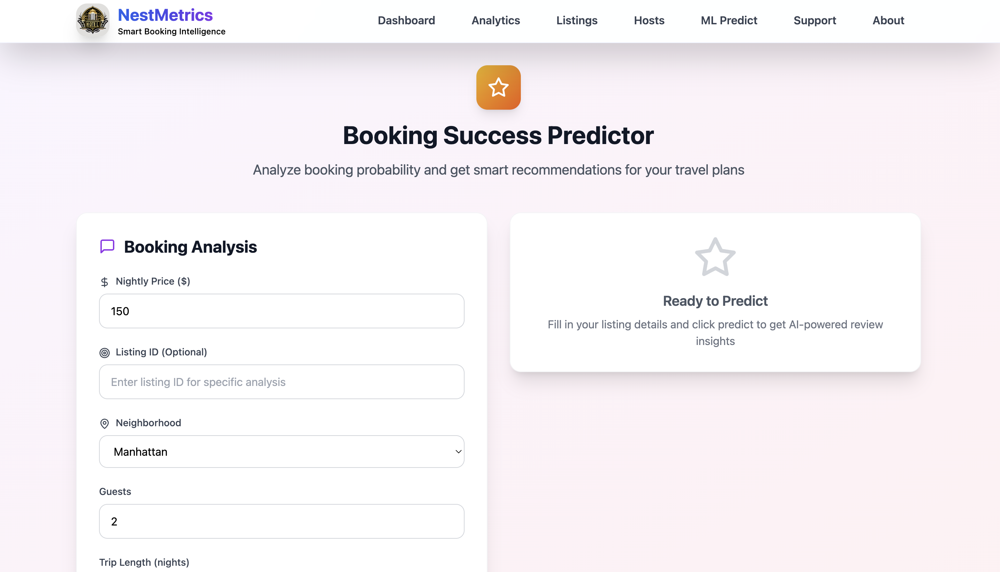
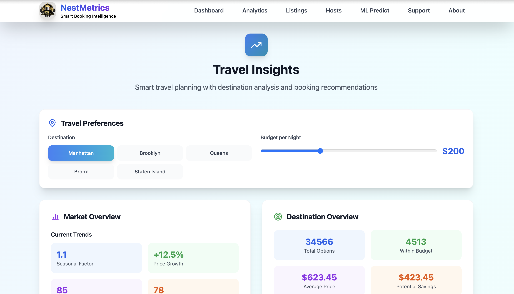
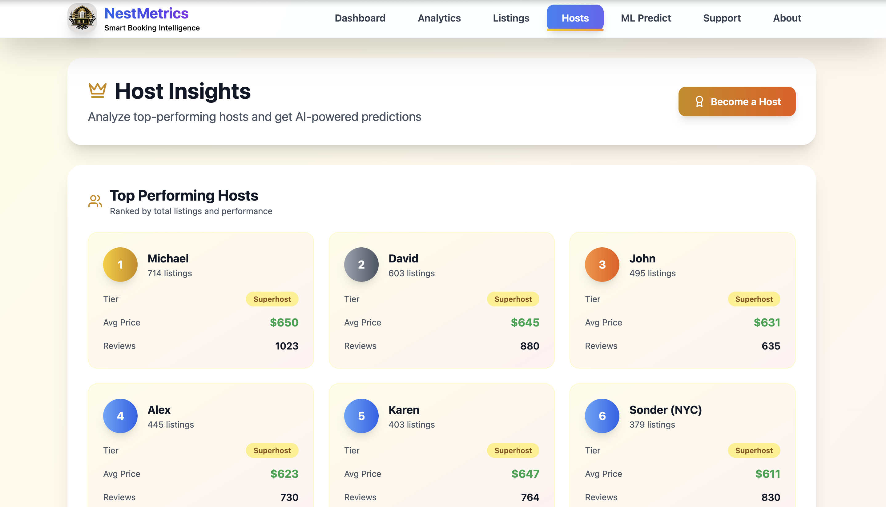
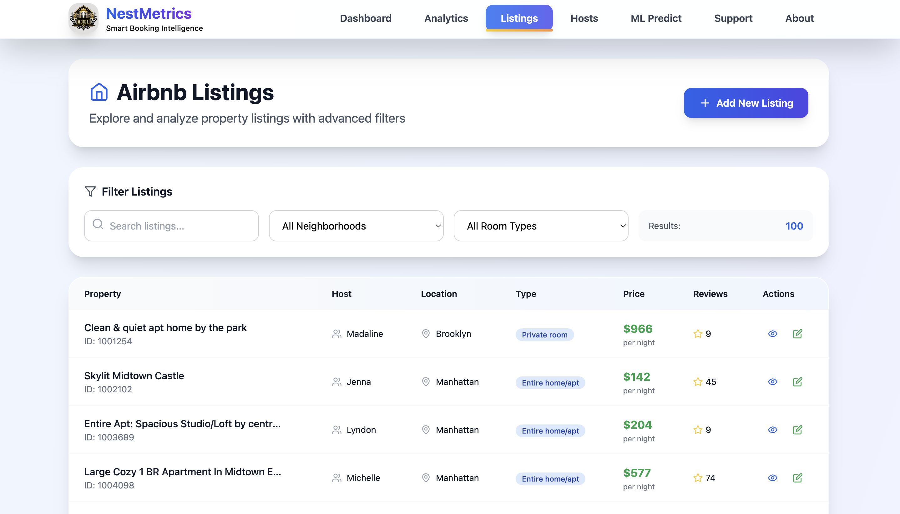
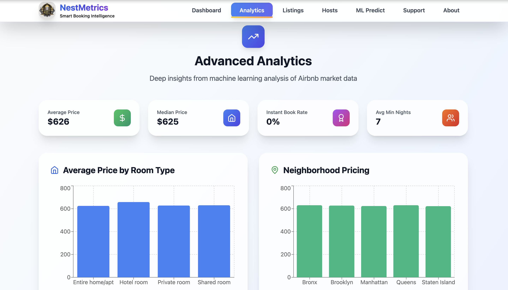
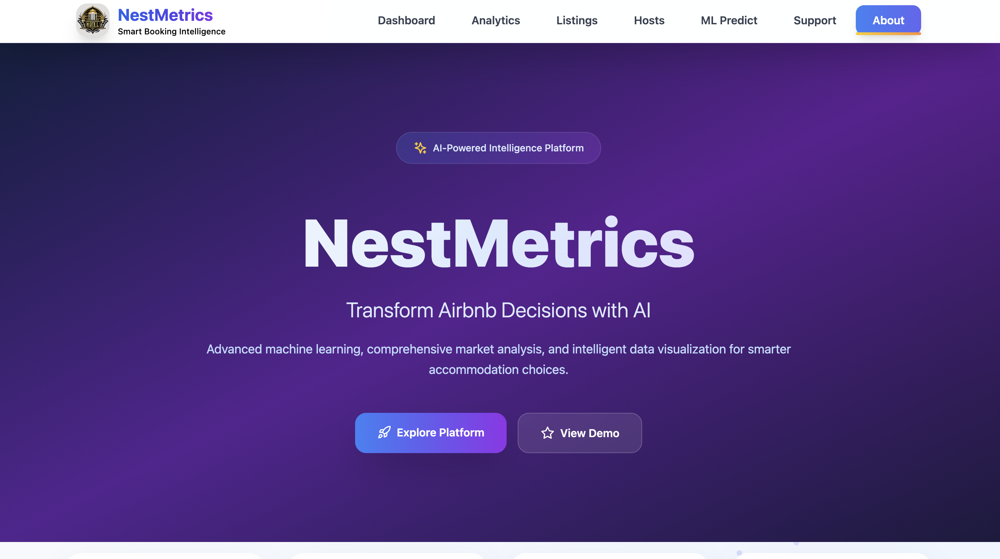

<h1 align="center">🏠 NestMetrics — AI-Powered Airbnb Smart Booking Insights</h1>

<p align="center">
  🚀 A full-stack AI-powered travel app that delivers predictive analytics, real-time insights, and interactive visualizations to help travelers make smarter accommodation choices.
</p>

<p align="center">
  
  
  
  
  
  
</p>
<br>

---

## 📖 Problem Statement
Travelers face significant challenges in finding the best Airbnb deals, predicting booking success, and making data-driven accommodation decisions. Traditional booking methods lack AI-powered insights, price predictions, and market intelligence required for optimal travel planning.

<br>

---

## 💡 Our Solution
NestMetrics is a full-stack web application built to:

- 🤖 Predict prices using Random Forest ML model trained on 80K+ listings
- 💰 Find best deals with AI-powered search and market analysis
- 📊 Provide booking success probability with confidence scoring
- 🗺️ Deliver comprehensive market insights across NYC boroughs
- 📈 Export analytics data and manage listings efficiently
<br>

---  

## 🚀 Features

✅  **ML Price Predictor** with **Random Forest Model (85% R² Score)**  
✅  **Smart Deal Finder** with AI-powered price analysis  
✅  **Booking Success Predictor** with confidence intervals  
✅  **Travel Intelligence** with destination insights  
✅  **Host Analytics** with performance rankings  
✅  **Real-time Market Data** from **80K+ NYC listings**  
✅  **Interactive Visualizations** with Recharts and Plotly

<br>

---  

## 🛠️ Tech Stack

<div align="center">

<table>
<thead>
<tr>
<th>🖥️ Technology</th>
<th>⚙️ Description</th>
</tr>
</thead>
<tbody>
<tr>
<td></td>
<td>Modern frontend with component architecture</td>
</tr>
<tr>
<td></td>
<td>Python web framework for ML APIs</td>
</tr>
<tr>
<td></td>
<td>Machine learning with Random Forest</td>
</tr>
<tr>
<td></td>
<td>Data manipulation and analysis</td>
</tr>
<tr>
<td></td>
<td>Numerical computing and arrays</td>
</tr>
<tr>
<td></td>
<td>Utility-first CSS framework</td>
</tr>
<tr>
<td></td>
<td>Fast build tool and development server</td>
</tr>
</tbody>
</table>

</div>

<br>

---

## 📁 Project Directory Structure

```
NestMetrics – Airbnb Smart Booking Insights/
├── 📂 frontend/                    # 🎨 React frontend application
│   ├── 📂 src/
│   │   ├── 📂 components/          # 🧩 Reusable UI components
│   │   │   ├── 📄 Cards.jsx        # 📊 Statistics cards
│   │   │   ├── 📄 Charts.jsx       # 📈 Data visualizations
│   │   │   ├── 📄 FeatureCard.jsx  # ✨ Feature showcase
│   │   │   ├── 📄 Footer.jsx       # 🔻 Footer with links
│   │   │   └── 📄 Navbar.jsx       # 🔝 Navigation header
│   │   ├── 📂 config/              # ⚙️ Configuration files
│   │   │   └── 📄 api.js           # 🔗 API endpoints config
│   │   ├── 📂 pages/               # 📄 Main application pages
│   │   │   ├── 📄 About.jsx        # ℹ️ About platform
│   │   │   ├── 📄 Analytics.jsx    # 📊 Advanced analytics
│   │   │   ├── 📄 Dashboard.jsx    # 🏠 Main dashboard
│   │   │   ├── 📄 Help.jsx          # ❓ Help & support
│   │   │   ├── 📄 HostInsights.jsx # 👥 Host analytics
│   │   │   ├── 📄 Listings.jsx     # 📋 Property listings
│   │   │   ├── 📄 LoadingPage.jsx  # ⏳ Loading screen
│   │   │   ├── 📄 MarketInsights.jsx # 🗺️ Travel intelligence
│   │   │   ├── 📄 MLPredictor.jsx  # 🤖 ML price predictions
│   │   │   ├── 📄 PricePredictor.jsx # 💰 Deal finder
│   │   │   └── 📄 ReviewPredictor.jsx # ⭐ Booking success
│   │   ├── 📄 App.jsx              # 🎯 Main app component
│   │   ├── 📄 index.css            # 🎨 Global styles
│   │   └── 📄 main.jsx             # 🚀 Entry point
│   ├── 📄 .env                     # 🔐 Local environment variables
│   ├── 📄 .env.example             # 🔐 Environment template
│   ├── 📄 .env.local               # 🔐 Local environment override
│   ├── 📄 .env.production          # 🌐 Production environment
│   ├── 📄 index.html               # 🌐 HTML template
│   ├── 📄 package.json             # 📦 Dependencies
│   ├── 📄 package-lock.json        # 🔒 Dependency lock file
│   ├── 📄 postcss.config.js        # 🎨 PostCSS configuration
│   ├── 📄 tailwind.config.js       # 🎨 Tailwind configuration
│   ├── 📄 vercel.json              # 🌐 Vercel deployment config
│   └── 📄 vite.config.js           # ⚡ Vite configuration
├── 📂 backend/                     # 🔧 Flask backend service
│   ├── 📂 data/                    # 📁 Raw datasets
│   │   └── 📄 Airbnb_Dataset.csv   # 📈 Original data (35MB)
│   ├── 📂 models/                  # 🤖 ML models and data
│   │   ├── 📄 model.pkl            # 🎯 Trained Random Forest (644MB)
│   │   └── 📄 Processed.csv        # 📊 Clean dataset (18MB, 83K rows)
│   ├── 📄 .deps_installed          # 🔧 Dependency installation flag
│   ├── 📄 app.py                   # 🚀 Flask application
│   ├── 📄 render.yaml              # 🌐 Render deployment config
│   └── 📄 requirements.txt         # 📦 Python dependencies
├── 📂 docs/                        # 📸 Screenshots and documentation
│   ├── 📄 About_Page.png           # 🖼️ About page screenshot
│   ├── 📄 Analytics_Page.png       # 📈 Analytics page screenshot
│   ├── 📄 Booking_Success_Page.png # ⭐ Booking success screenshot
│   ├── 📄 Deal_Finder_Page.png     # 💰 Deal finder screenshot
│   ├── 📄 Help_And_Support.png     # ❓ Help page screenshot
│   ├── 📄 Home_Page.png            # 🏠 Dashboard screenshot
│   ├── 📄 Host_Insights.png        # 👥 Host insights screenshot
│   ├── 📄 Listings_Page.png        # 📋 Listings page screenshot
│   ├── 📄 Loading_Page.png         # ⏳ Loading screen screenshot
│   ├── 📄 Prediction_Page.png      # 🤖 ML predictor screenshot
│   └── 📄 Travel_Insights.png      # 🗺️ Travel insights screenshot
├── 📂 notebooks/                   # 📓 Jupyter notebooks
│   └── 📄 model_training.ipynb     # 🧪 ML model training
├── 📄 .gitignore                   # 🚫 Git ignore rules
├── 📄 LICENSE                      # 📜 MIT License
├── 📄 README.md                    # 📖 Project documentation
└── 📄 start.sh                     # 🚀 Start all services

```
<br>

## 📸 Preview Images

| 📍 Page / Feature            | 📸 Screenshot                                              |
|:----------------------------|:-----------------------------------------------------------|
| Loading Screen              |                 |
| Dashboard                   |                         |
| ML Price Predictor          |                |
| Smart Deal Finder           |                |
| Booking Success Predictor   |        |
| Travel Intelligence         |             |
| Host Analytics              |                 |
| Property Listings           |                      |
| Advanced Analytics          |                    |
| Help & Support              |                  |
| About Platform              |                       |

<br>

---

## 📦 How to Run

### 📌 Prerequisites
- ✅ **Python 3.8+** installed
- ✅ **Node.js 16+** installed
- ✅ **npm** package manager

<br>

---  

### 🚀 Quick Start

1. Clone and start all services:

   ```bash
   git clone https://github.com/AbhishekGiri04/NestMetrics
   cd "NestMetrics – Airbnb Smart Booking Insights"
   chmod +x start.sh && ./start.sh
   ```

2. Access the platform:

   ```
   Frontend: http://localhost:5173
   Backend API: http://localhost:5001
   ```

### 🔧 Manual Setup (Alternative)

#### Backend Setup
```bash
cd backend
python3 -m venv venv
source venv/bin/activate  # On Windows: venv\Scripts\activate
pip install -r requirements.txt
python app.py
```

#### Frontend Setup
```bash
cd frontend
npm install
npm run dev
```

<br>

### 🛑 Stop Services

```bash
# Kill processes manually
pkill -f "python app.py"
pkill -f "npm run dev"
```
<br>

---

## 📖 Core Components

* **Dashboard.jsx** — Main analytics dashboard with market overview
* **MLPredictor.jsx** — Random Forest ML model for price predictions
* **PricePredictor.jsx** — Smart deal finder with AI-powered search
* **ReviewPredictor.jsx** — Booking success probability calculator
* **MarketInsights.jsx** — Travel intelligence and destination analysis
* **HostInsights.jsx** — Host performance rankings and analytics
* **app.py** — Flask server with ML APIs and data processing
* **model.pkl** — Trained Random Forest model (644MB)
* **Processed.csv** — Clean dataset with 83K+ listings

<br>

---

## 🌐 API Endpoints

```bash
# Backend API (Port 5001)
GET  /api/test              # Health check
GET  /api/stats             # Dashboard statistics
GET  /api/advanced-analytics # Market insights
POST /api/ml-predict        # ML price predictions
POST /api/find-deals         # Deal discovery
POST /api/booking-score      # Booking probability
GET  /api/listings           # Property listings
GET  /api/top-hosts          # Host rankings
GET  /api/travel-insights    # Travel intelligence
```
<br>

---

## 🧪 Testing

```bash
# Test API endpoints
curl http://localhost:5001/api/test
curl http://localhost:5001/api/stats

# Test ML prediction
curl -X POST http://localhost:5001/api/ml-predict \
  -H "Content-Type: application/json" \
  -d '{"room_type":"Entire home/apt","neighbourhood_group":"Manhattan","minimum_nights":1,"availability_365":365,"host_listings":1}'
```

## ⚠️ Common Issues

**Backend not starting:**
```bash
cd backend && rm -rf venv && python3 -m venv venv
source venv/bin/activate && pip install -r requirements.txt
```

**Frontend not loading:**
```bash
cd frontend && rm -rf node_modules && npm install
```

**Port conflicts:**
- Backend uses port 5001 (configurable in app.py)
- Frontend uses port 5173 (Vite default)

<br>

---

## 📊 Performance Metrics

- **85% ML Accuracy** — Random Forest R² Score for price predictions
- **80K+ Listings** — Real NYC Airbnb dataset coverage
- **<200ms API** — Average response time for predictions
- **95+ Lighthouse** — Frontend performance score
- **5 NYC Boroughs** — Complete market coverage
- **Real-time Analytics** — Live data processing and insights

<br>

---

## 🌱 Future Scope
- 📱 **Mobile Application** — React Native mobile app development
- 🌍 **Real-time Data** — Live Airbnb API integration
- 📊 **Advanced ML** — Deep learning models and neural networks
- 🔐 **User Authentication** — Personalized recommendations
- 🚀 **Microservices** — Containerized architecture with Docker
- 🗺️ **Interactive Maps** — Leaflet/Mapbox integration

  <br>

  ---  

## 📞 Help & Contact  

> 💬 *Got questions or need assistance with NestMetrics Platform?*  
> We're here to help with technical support and collaboration!

<div align="center">

<b>👤 Abhishek Giri</b>  
<a href="https://www.linkedin.com/in/abhishek-giri04/">
  
</a>  
<a href="https://github.com/abhishekgiri04">
  
</a>  
<a href="https://t.me/AbhishekGiri7">
  
</a>

<br/>

---

## 📄 License

This project is licensed under the MIT License - see the [LICENSE](LICENSE) file for details.

---

**🏠 Built with ❤️ for Smart Travel Decisions**  
*Transforming Airbnb Booking Through AI Innovation*

</div>

---

<div align="center">

**© 2025 NestMetrics – Airbnb Smart Booking Insights. All Rights Reserved.**

</div>
